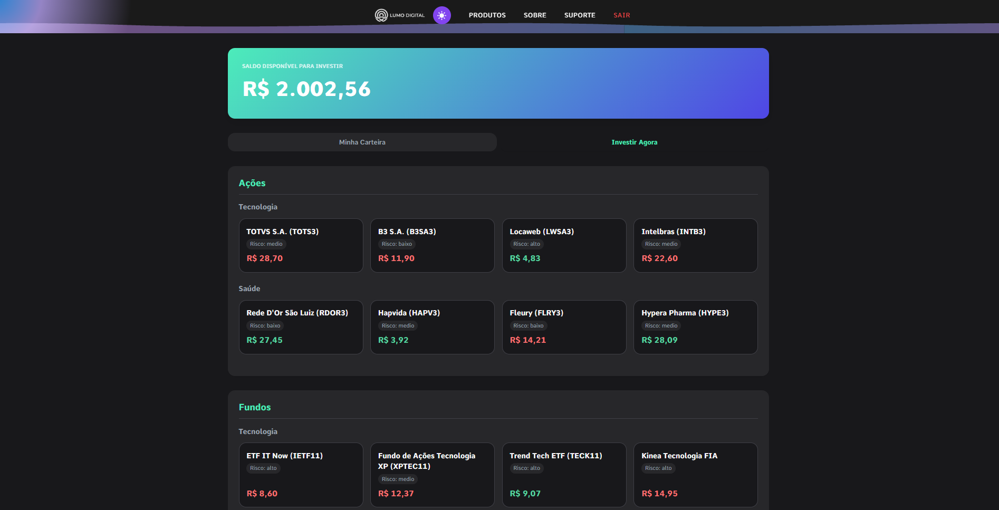
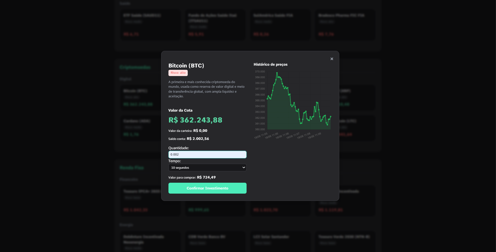
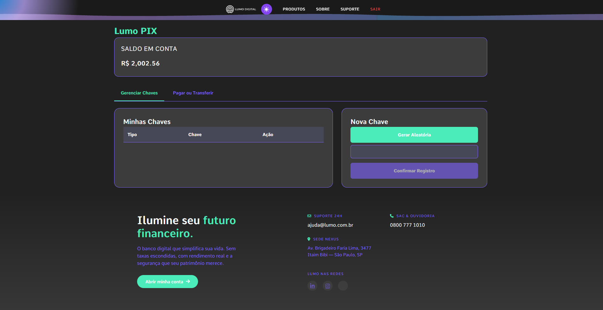

# 🏦 Lumo Digital

Lumo Digital é um simulador de banco digital desenvolvido como projeto de estudo em Python e Flask.

A ideia foi recriar funcionalidades comuns de aplicativos bancários, como transferências, PIX, cartões, investimentos e empréstimos, enquanto eu aprendia conceitos de desenvolvimento web, banco de dados e organização de aplicações.

---

## Funcionalidades

- Cadastro e login de usuários
- Contas bancárias com saldo virtual
- Transferências entre contas
- Sistema de PIX com diferentes tipos de chave
- Cartões de crédito e débito
- Empréstimos
- Extrato de movimentações
- Sistema de investimentos com preços simulados
- Empregos e recebimento de salário automático
- Notificações dentro da plataforma

---

## Tecnologias utilizadas

- Python
- Flask
- SQLite
- APScheduler
- Werkzeug

---

## O que aprendi

Durante o desenvolvimento deste projeto pratiquei:

- Criação de aplicações web com Flask
- Rotas e organização de funcionalidades
- Manipulação de banco de dados
- Autenticação de usuários
- Tarefas executadas em segundo plano
- Estruturação de projetos maiores em Python

---

## Como executar

```bash
git clone <repositorio>
cd Simulador-Banco
pip install -r requirements.txt
python app.py
python tasks.py          # Tarefas automáticas executadas pelo agendador
```

A aplicação ficará disponível localmente no navegador.

---

## Observações

Este projeto foi feito para estudo e foi crescendo aos poucos conforme eu aprendia Flask e adicionava novas funcionalidades.

Por isso, algumas partes da aplicação poderiam ser melhor organizadas ou separadas em mais camadas de serviço em uma futura refatoração.

O foco principal foi aprender conceitos de desenvolvimento web, banco de dados e lógica de negócio, e não seguir todos os padrões utilizados em aplicações de produção.

Este sistema é apenas uma simulação e não possui os requisitos de segurança e conformidade necessários para um banco real.

## Screenshots

| Dashboard | Área de Investimentos |
|------------|------------|
|  |  |

| Detalhes do Investimento | PIX |
|------------|------------|
|  |  |
